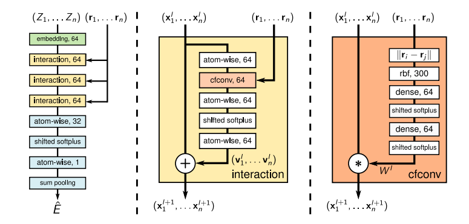

# EnzymeCAGE - summary

## Functionality

- Enzyme function prediction
  - Predicting the functions of uncharacterized enzymes within a list of known enzymatically-catalyzed reactions
  - Specifying a desired reaction and then virtually retrieving enzyme sequences/structures for compatibility
- Reaction de-orphaning 
- Catalytic site identification
- Biosynthetic pathway reconstruction

## Training Data

Trained on approximately 1 million structure-informed enzyme-reaction pairs, spanning over 2,000 species and encompassing an extensive diversity of genomic and metabolic information

RHEA
BRENDA
MetaCyc

Constructed a dataset comprising over 914,077 enzyme-reaction pairs

### Data cleaning 

Optimizind the data by removing invalid entries and standardizing formats.
Specifically, enzyme entries without UniProt ID or sequence data were excluded.
For reactions, we applied the following criteria: 
  - Remove cofactors, ions, and small molecules present on both substrate and product sides
  - Exclude reactions involving more than five substrates or products
  - Standardize molecular SMILES using OpenBabel

This refinement yielded 328,192 enzyme-reaction pairs, comprising 145,782 unique enzymes and 17,868 distinct reactions

### Generating negative samples

To enhance model training, we generated negative samples. We created two types of negatives: 

- Negative Enzymes for Reactions – Given a reaction, we identified catalyzing enzymes and retrieved homologous proteins and dissimilar enzymes (in a 2:1 ratio) as negative examples(Supplementary Fig. S3). Homologous proteins with greater than 40% sequence similarity were identified using MMseqs2 [61]. Dissimilar enzymes were selected by choosing enzymes with different top-three-level EC classifications. 

- Negative Reactions for Enzymes – We used RXNMapper and RDChiral [62] to generate reaction templates with atom-atom mappings and EC annotations. For each positive enzyme-reaction pair, we applied a non-corresponding reaction template to the enzyme’s sub401 strate to generate a new product and negative sample.

This augmentation process expanded the training set to 914,077 enzyme-reaction pairs

### Test sets

**Orphan-194**
For the test set Orphan-194, we first filtered the full dataset to retain only reactions with EC numbers found in the training set and identified 690 reactions without EC numbers as candidates for the test set. These reactions have a similarity score below 0.9 compared to any reaction in the training set and are catalyzed by at least five enzymes. We then applied a temporal filter, selecting only reactions that had no recorded catalyzing enzyme in the RHEA database before 2018 but were later annotated with enzymes after 2023. This refinement yielded a final test set of 194 reactions, designated as Orphan-194.

**Loyal 1968**
For the Loyal-1968 test set, we identified non-promiscuous enzymes that have been reported to catalyze only a single reaction. Using MMseqs2 with a cutoff of 0.4, we retrieved homologous proteins as negative samples. This set was curated to include reactions with: (1) at least one non-promiscuous enzyme as a positive example, (2) each non-promiscuous enzyme having over 10 homologous proteins, and (3) a ratio of homologous to non-promiscuous enzymes of at least 3:1. These criteria ensure functional diversity and exclude positive enzymes present in the training data. The final Loyal-1968 test set consists of 455 reactions with a total of 71,853 enzyme-reaction pairs, covering 1,968 enzymes across 77 unique top-three-level EC numbers.

## Catalytic Pocket and Reaction Center Extraction

To generate catalytic pocket data, we downloaded AlphaFold structures for all enzymes and applied AlphaFill [44] to extract the enzyme pockets. For identifying reaction center, we used atom-atom mapping of the reactions. In the pocket extraction process, AlphaFill first identified homologous proteins of the tar4get enzyme in the PDB-REDO database [63] and located their protein-ligand complexes.

Ligands from these homologous complexes were then transplanted onto the target enzyme structure through structural alignment.

Following ligand transplantation, we selected ligands based on their atomic count and occurrence frequency and defined the catalytic pocket using an 8 ˚A radius around each ligand.

A clustering analysis on the extracted pockets using Foldseek [64] showed that catalytic pockets have higher functional relevance than entire enzyme structures, supporting the focus on the pocket-level analysis and modeling.

To identify reaction center, we employed RXNMapper to generate atom-atom mappings between substrates and products. Using this mapping, we identified atoms involved in bond changes, charge shifts, and chirality alterations, marking these as the reaction center for the catalyzed transformation.

## Model and Architecture

### Enzyme representation

EnzymeCAGE uses **GVP** to encode pocket graphs due to its computational efficiency.

EnzymeCAGE uses ESM2 to capture global features at the full-enzyme scale.

### Identify reaction center

#### Key Insight for identifying reaction center

There is no learning for identifying the reaction center, and this is actually a **design choise**:
- Injects domain knowledge about chemical reactions
- Focuses the model on chemically relevant atoms
- Reduces the burden on the model to infer reaction centers
- Trades off end-to-end learning for inductive bias

#### Input representation (2D)

Each molecule is represented as a graph with:
- Atoms (nodes):
   - Element type (C, N, O, …)
   - Formal charge
   - Chirality
   - Valence
- Bonds (edges):
   - bond type (single, double, aromatic, etc.)

These typically come from:
- SMILES / reaction SMILES
- Parsed using chemistry tools like RDKit

To compare substrate ↔ product, the model needs:
Atom mapping — which atom in the substrate corresponds to which atom in the product

This usually comes from:
- Reaction datasets (e.g., USPTO)
- or computed via atom-mapping algorithms

#### Atom mapping 

To compare substrate ↔ product:
- Atom mapping identifies correspondence between atoms. 
- Comes from:
    - Reaction datasets (e.g., USPTO)
    - or atom-mapping algorithms

#### Identify reaction center

“atoms that undergo changes in bonding, charge, or chirality”

Reaction center identification relies on **2D graph information**, not on 3D geometry.

Inputs:
- Substrate graph
- Product graph
- Atom mapping

Method:
- Graph comparison (rule-based)
- Detect:
   - Bond changes (formed/broken)
   - Bond order changes 
   - Charge changes
   - Chirality changes

#### Assign weights

- Atoms in reaction center → higher weights
- Others → lower weights

Manually defined heuristic / preprocessing

#### Generate 3D conformations

- Substrate & product conformations are computed (e.g., RDKit)

### Substrate and product representation

EnzymeCAGE uses **SchNet** to separately encode substrate and product conformations, providing an effective representation of reaction dynamics.

- It computes substrate and product conformations.
- It identifies the reaction center by pinpointing atoms that undergo changes in bonding, charge, or chirality during catalysis.
- Different weights are then assigned to atoms within the reacting area, with higher weights for atoms located in the reaction center.

## Algorithms EzymeCAVE Relies on

### GVP

Is used to encode pocket graphs

### SchNet

SchNet is used to separately encode substrate and product conformations, providing an effective representation of reaction dynamics

**Input**: Atomic numbers and 3D positions of the molecule
**Output**: Molecule embeddings

$f^s = SchNet(V_s, E_s)$  ;   $f^p = SchNet(V_p, E_p)$

$W_r$ - Reacting area weight matrix

$f^r = CrossAttention(f^s, f^p, W_r)$

### RBF-encoded distances

## Enzyme Representation

Enzyme structures, evolutionary insights, and reaction center transformations

## Architecture

EnzymeCAGE begins by extracting catalytic pockets using AlphaFill
Then encodes geometric features of the pocket, including backbone atomic coordinates, dihedral angles, and side-chain torsions. This pocket region is represented as a graph: nodes correspond to residues with features such as residue type and geometric encodings, while edges represent bonds and residue connections, with features including atomic distances and orientations

## Fine-tuning

Through simple fine-tuning, EnzymeCAGE can quickly adapt to family-specific tasks, improving its predictive accuracy within specific enzyme families.
To illustrate its practical utility, we present a case study involving glutarate synthesis, where EnzymeCAGE accurately reconstructs a natural product pathway and significantly outperforms current state-of-the-arts methods

## Evaluation

- EnzymeCAGE was bench marked against state-of-the-art enzyme function prediction methods, including two similarity-based approaches, Selenzyme and BLASTp
- Two deep learning-based methods: ESP, CLEAN
- Four evaluation metrics were used to assess retrieval performance:  
   - Area under the curve (AUC)
   - Top-10 Discounted Cumulative Gain (DCG)
   - Top-k Success Rate (SR)
   - Enrichment Factor (EF)

### Enzyme Function Prediction

### Pinpoint catalytic regions for unseen enzymes

### Reaction De-orphaning

## Results

EnzymeCAGE excels in anticipating the function of unseen enzymes and annotating orphan reactions with the enzymes that catalyze them, demonstrating better retrieval results through a sequence similarity-free retrieval approach that is orthogonal to conventional methods

EnzymeCAGE distinguished between enzymes with high sequence similarity but distinct functions. For 1,968 positive enzymes in the test set, ESM2 embeddings and tSNE were used to visualize the embeddings, selecting a cluster of five enzymes with different EC classes, indicating high sequence similarity yet functional diversity.

## Discussion 

### Focusing on extraction of the enzyme pocket
In traditional enzyme function prediction, methods typically encode the entire enzyme, including regions that may be functionally less relevant. This redundant information can make it challenging for models to learn enzyme functions accurately. A key advantage of our approach lies in the focused extraction of the enzyme pocket, focusing on relevant structural information and hypothetical pocket-specific enzyme-reaction interactions.  Furthermore, the AlphaFill-predicted pockets do not rely on ground truth data for catalytic active sites or strictly defined pocket boundaries. As a result, the model’s predictions will exhibit a degree of robustness to minor errors or variations in pocket definitions.

### Mapping Reaction Centers
For reaction encoding, we calculate a reacting area weight matrix as a form of geometric guidance to help the model more effectively capture and learn the reaction center. This involves determining atom-atom mappings to identify reactive sites. Accurately mapping reaction centers remains a significant challenge, particularly for highly complex biological reactions, due to the lack of universally reliable ”ground truth” atom mapping information. To address this limitation, the reacting area weight matrix is designed to be flexibly applied as optional geometric guidance, serving as attention weight adjustments. This allows the model to leverage this additional information when available, with343 out making it a strict requirement for all data points. To further enhance model performance, future work could focus on developing more robust atom-atom mapping tools for large, complex reactions. This advancement would improve reaction center extraction, leading to better data quality and, ultimately, more effective enzyme function modeling

### Ablation study

### Predicting the location of active sites
Although EnzymeCAGE primarily focuses on enzyme retrieval and func tion prediction by predicting enzyme-reaction interactions, the model also provides interpretability in its predictions. When using the geometric cross373 attention model to learn the interaction between enzyme and reaction, we extract attention weights and use them to identify active sites. In many enzymes, this method accurately predicts the location of active sites. However, a current limitation is that we can only identify active sites located within the enzyme pocket as estimated by AlphaFill, while in reality, some active sites may lie outside the pocket but are involved in catalysis

## My Comments and Questions

### Why not using GVP to represnt substrates and products

Substrates and products are much small molecules comparing to proteins.
For proteins, structure ≈ one meaningful fold
For small molecules - many valid conformations

Proteins: Need geometry → 3D-aware

Small molecues: Chemistry is mostly about bond types, functional groups, connectivity

GVP:
- Assumes a meaningful, stable 3D geometry, and the 3D conformations of small molecules are noisy, not unique (many conformers), and sometime unavailable.
- Is computationally heavier
- Uses vector features (more memory, more compute)

But EnyzmeCAGE needs:
- Large-scale retrieval
- Fast embedding of many molecules

### Identifying the reaction center

There is no learning for identifying the reaction center, and this is actually a **design choise**

