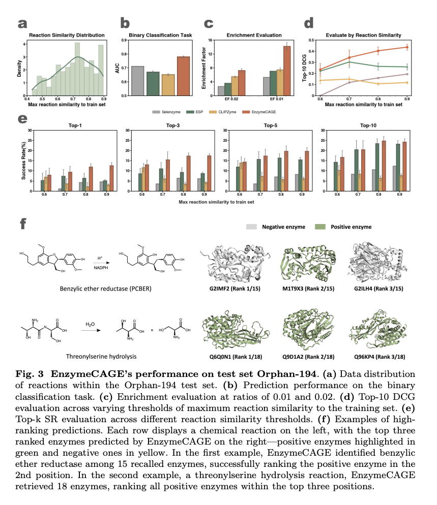

# EnzymeCAGE - summary

## Overview

EnzymeCAGE excels in anticipating the function of unseen enzymes and annotating orphan reactions with the enzymes that catalyze them, demonstrating better retrieval results through a sequence similarity-free retrieval approach that is orthogonal to conventional methods

EnzymeCAGE distinguished between enzymes with high sequence similarity but distinct functions. For 1,968 positive enzymes in the test set, ESM2 embeddings and tSNE were used to visualize the embeddings, selecting a cluster of five enzymes with different EC classes, indicating high sequence similarity yet functional diversity.

## Terms

- **Reaction center** - refers to atoms in the **substrates/products** that undergo changes during the reaction.
- **Active site** - the residues in the **enzyme** directly involved in catalysis.
- **Pocket center** - a geometric reference point (a coordinate) in the **enzyme**, typically the centroid of pocket residues, used to approximate the location of the active site.

## Functionality

- Enzyme function prediction
  - Predicting the functions of uncharacterized enzymes within a list of known enzymatically-catalyzed reactions
  - Specifying a desired reaction and then virtually retrieving enzyme sequences/structures for compatibility
- Reaction de-orphaning 
- Catalytic site identification
- Biosynthetic pathway reconstruction

## Training Data

Trained on approximately 1 million structure-informed enzyme-reaction pairs, spanning over 2,000 species and encompassing an extensive diversity of genomic and metabolic information

RHEA
BRENDA
MetaCyc

Constructed a dataset comprising over 914,077 enzyme-reaction pairs

### Data Cleaning

Optimizind the data by removing invalid entries and standardizing formats.
Specifically, enzyme entries without UniProt ID or sequence data were excluded.
For reactions, we applied the following criteria: 
  - Remove cofactors, ions, and small molecules present on both substrate and product sides
  - Exclude reactions involving more than five substrates or products
  - Standardize molecular SMILES using OpenBabel

This refinement yielded 328,192 enzyme-reaction pairs, comprising 145,782 unique enzymes and 17,868 distinct reactions

### Generating negative samples

To enhance model training, we generated negative samples. We created two types of negatives: 

- Negative Enzymes for Reactions – Given a reaction, we identified catalyzing enzymes and retrieved homologous proteins and dissimilar enzymes (in a 2:1 ratio) as negative examples(Supplementary Fig. S3). Homologous proteins with greater than 40% sequence similarity were identified using MMseqs2 [61]. Dissimilar enzymes were selected by choosing enzymes with different top-three-level EC classifications. 

- Negative Reactions for Enzymes – We used RXNMapper and RDChiral [62] to generate reaction templates with atom-atom mappings and EC annotations. For each positive enzyme-reaction pair, we applied a non-corresponding reaction template to the enzyme’s sub401 strate to generate a new product and negative sample.

This augmentation process expanded the training set to 914,077 enzyme-reaction pairs

### Test sets

**Orphan-194**
For the test set Orphan-194, we first filtered the full dataset to retain only reactions with EC numbers found in the training set and identified 690 reactions without EC numbers as candidates for the test set. These reactions have a similarity score below 0.9 compared to any reaction in the training set and are catalyzed by at least five enzymes. We then applied a temporal filter, selecting only reactions that had no recorded catalyzing enzyme in the RHEA database before 2018 but were later annotated with enzymes after 2023. This refinement yielded a final test set of 194 reactions, designated as Orphan-194.

**Loyal 1968**
For the Loyal-1968 test set, we identified non-promiscuous enzymes that have been reported to catalyze only a single reaction. Using MMseqs2 with a cutoff of 0.4, we retrieved homologous proteins as negative samples. This set was curated to include reactions with: (1) at least one non-promiscuous enzyme as a positive example, (2) each non-promiscuous enzyme having over 10 homologous proteins, and (3) a ratio of homologous to non-promiscuous enzymes of at least 3:1. These criteria ensure functional diversity and exclude positive enzymes present in the training data. The final Loyal-1968 test set consists of 455 reactions with a total of 71,853 enzyme-reaction pairs, covering 1,968 enzymes across 77 unique top-three-level EC numbers.

## Key Algortihms Used

**Core Model Components**
- GVP
- SchNet
- Self-Attention
- Cross-Attention
- MLP

**Pretrained Representations**
- ESM2
- DRFP

**Preprocessing Tools**
- AlphaFold
- AlphaFill
- RXNMapper

## Pre-processing

### Catalytic Pocket Extraction

To generate catalytic pocket data, we downloaded AlphaFold structures for all enzymes and applied AlphaFill to extract the enzyme pockets. For identifying reaction center, we used atom-atom mapping of the reactions. In the pocket extraction process, AlphaFill first identified homologous proteins of the tar4get enzyme in the PDB-REDO database and located their protein-ligand complexes.

Ligands from these homologous complexes were then transplanted onto the target enzyme structure through structural alignment.

Following ligand transplantation, we selected ligands based on their atomic count and occurrence frequency and defined the catalytic pocket using an 8 ˚A radius around each ligand.

A clustering analysis on the extracted pockets using Foldseek showed that catalytic pockets have higher functional relevance than entire enzyme structures, supporting the focus on the pocket-level analysis and modeling.

### Reaction Center Extraction

To identify reaction center, we employed RXNMapper to generate atom-atom mappings between substrates and products. Using this mapping, we identified atoms involved in bond changes, charge shifts, and chirality alterations, marking these as the reaction center for the catalyzed transformation.

## Model and Architecture

### Model Overview

- Protein Pocket Encoder (GVP + Self-Attention)
- 3D Conformer Generation
- Reaction Encoder (SchNet + Reaction Center Weighting)
- Enzyme-Reaction Interaction Module
- Final Prediction Module (Global Integration)

### Protein Pocket Encoder (GVP + Self-Attention)

**Input**: enzyme pocket residues, residue types, residue positions, dihedral angles, orientations, side-chain information, relative positional vectors and RBF-encoded distances.
**Output**: $f^e$ - ($f^{enzyme}$) a set of contextualized, geometry-aware residue embeddings for the protein, capturing both local 3D structure (via GVP) and global relationships (via self-attention).

  <bp>
  <bp>

This module models interactions within a predefined candidate pocket region by representing the pocket as a graph $G_e = (V_e, E_e)$  

#### Multi-head self attention

A multi-head self-attention model is applied, with the distance map $D_m$ serving as an attention bias to enhance the model’s understanding of relative positional relationships among residues:

$f^e = \mathrm{SelfAttention}\left( \mathrm{GVP}(V_e, E_e), D_m \right)$
  

$V_e$ - denotes node features such as residue types, residue positions, dihedral angles, orientations, and side-chain information.

$E_e$ - represents edge features, including relative positional vectors and RBF-encoded distances. 

$D_m = \{ d_{ij} \mid i, j \in V \}$ - a residue-level distance map to further refine residue relationships. $d_{ij}$ represents the distance between residues $i$ and $j$.

The multi-head self-attention is applied, with the distance map $D_m$ as an attention bias to enhance the model's understanding of relative positional relationships among residues.
GVP captures local geometric interactions, while self-attention captures global, long-range dependencies
The resulting output, $f^e$, encodes the local geometric and biochemical information of the catalytic pocket.

#### GVP embeddings explanation

For each residue $i$:

$h_i^{\mathrm{protein}} \in \mathbb{R}^{d}, \quad f^e = \{ h_i^{\mathrm{protein}} \}_{i=1}^{N}$
  

Each embedding encodes:
- Local geometry (from GVP): Spatial arrangement of neighboring residues, orientations / structural motifs, backbone geometry
- Global context (from attention): Long-range interactions, relationships between distant residues, overall fold context
- Functional hints (implicitly learned) - Even though no reaction info is used: Active site patterns, binding pocket geometry, structural motifs

### 3D Conformer Generation

**Input**: substrate and product atom information - atom types, bond connectivity, bond type (single, double, aromatic,...). Usually using SMILES or reaction SMILES.
**Output**: substrate and product conformations

- Substrate & product conformations are computed (e.g., RDKit)

### Reaction Encoder (SchNet + Reaction Center Weighting)

**Input**: substrate and product atom information - atom types, 3D coordinates, atom features (formal charge, valence, etc.), reaction center weights 
**Output**: $f^r$ - ($f^{reaction}$) Atom-level embeddings capturing the full reaction context

This module captures relationships between substrate and product representations in a reaction, generating a comprehensive reaction representation.
It tries to capture dynamic transformations between substrate and product molecules.
It relies on the reaction center information.
Reaction center step: “These atoms matter”
SchNet encodes the 3D local chemical environment of atoms

EnzymeCAGE uses **SchNet** to separately encode substrate and product conformations, providing an effective representation of reaction dynamics.
SchNet is used to convert 3D substrate and product structures into atom-level embeddings, guided by reaction-center weights.

SchNet is good at:
- Capturing local atomic environments
- Modeling interatomic distances

#### Calculate reacting area weight matrix

First, for each molecule (either substrate or product), we define a set $C$ of indices corresponding to atoms at the reaction center. $C$ holds the reaction center information.
We then create a vector $R$ to indicate these centers and calculate a reacting area weight matrix as follows

$R = (r_1, r_2, \ldots, r_M), \quad \text{where } r_i = \begin{cases} 1, & \text{if } i \in C \\ 0, & \text{if } i \notin C \end{cases}$
  

$W_r = R_s \otimes R_p$
  

$r_i$ - represents an element of the vector $R$, and $M$ is the total number of atoms in the molecule.

$R_s$ and $R_p$ - denote the reaction center of the substrate and product, respectively.

$W_r$ - the reacting area weight matrix for the reaction.

#### Encode sbstrate and product graphs

The substrate and product conformations are represented as graphs, $G_s = (V_s, E_s)$ and $G_p = (V_p, E_p)$, respectively, where each node represents an atom with features like atom type and position, and each edge represents a bond between atoms.

A 3D molecular GNN, specifically SchNet, encodes these substrate and product graphs:

$f^s = \text{SchNet}(V_s, E_s)$  ;   $f^p = \text{SchNet}(V_p, E_p)$
  

#### Interaction module based on cross-attention

Using the molecular embeddings $f_s$ and $f_p$, and the reacting area weight matrix $W_r$, we build an interaction module based on cross-attention:

$f^r = \text{CrossAttention}(f^s, f^p, W_r)$
  

$W_r$ - acts as an attention bias, guiding the model to focus effectively on the reaction center. It biases attention toward reaction-relevant atoms.

$f^r$ - Atom-level embeddings capturing the full reaction context.

### Enzyme-Reaction Interaction Module

**Input**: $f^e$, $f^r$, $R_s$
**Output**: $z$ - the final embedding produced by the Geometry-enhanced Interaction Module, capturing the interaction between the catalytic pocket and the chemical reaction

This module models the interactions between the catalytic pocket and the chemical reaction, employing geometric guidance to determine enzyme reaction interaction weights. 

#### Calculate a distance-based geometric importance score

We calculate a distance-based geometric importance score for each residue in the catalytic pocket based on its proximity to the pocket center, approximating the active site:
(Note: this step doesn't use any information related to the substrates and products)

$X_{\text{center}} = \frac{1}{N} \sum_{i=1}^{N} x_i$
  

$d_i = \lVert x_i - X_{\text{center}} \rVert$
  

$S_c = (s_1, s_2, \ldots, s_N), \quad \text{where } s_i = 1 - \frac{d_i}{d_{\max}}$
  

$X_{\text{center}}$ - represents the geometric center of the pocket.

$x_i$ - represents the 3D coordinate (position) of residue $i$  in the catalytic pocket. The model relies on an external pocket detection step (preprocessing).

$N$ - denotes the number of residues in the catalytic pocket.

$S_c$ - the distance-based geometric importance score, where residues closer to the pocket center receive higher scores.

#### Compute enzyme-reaction interaction weight matrix

Next, we compute the enzyme-reaction interaction weight matrix by combining the pocket distance-based geometric importance scores with the reaction center weights of the substrate:

$W_I = S_c \otimes R_s$
  

$W_I \in \mathbb{R}^{N \times M}$
  

$W_I[i, j] = s_i \cdot r_j = \begin{cases} 0, & \text{if }r_j=0  \\ s_i, & \text{if } r_j=1 \end{cases}$
  

$S_c$ - weights for N residues (enzyme).

$R_s$ - weights for M atoms (substrate/product). Was calculated in the previous section.

$W_I$ - denotes the enzyme-reaction interaction weight matrix.

#### Cross-attention to enhance the enzyme-reaction interaction

Using $W_I$ as a geometric guidance in the cross-attention model to enhance the enzyme-reaction interaction:

$z = \mathrm{\text{CrossAttention}}(f^e, f^r, W_I)$
  

$f^e$ and $f^ r$ - represent the feature embeddings of the catalytic pocket and the reaction, respectively.

### Final Prediction Module (Global Integration)

**Input**: $z$, $f_{esm}$ (from ESM2), $f_{DRFP}$
**Output**: $p$ - the probability that the input enzyme can catalyze its associated given reaction. 

To generate the final prediction, EnzymeCAGE combines local pocket reaction embeddings, global enzyme embeddings, and reaction embeddings. EnzymeCAGE encodes the full enzyme using ESM2, producing a global enzyme representation denoted as $f_{esm}$.

For the reaction, EnzymeCAGE uses the reaction fingerprint DRFP, producing the reaction embedding $f_{DRFP}$.

The global enzyme representation $f_{esm}$ and the reaction fingerprint $f_{DRFP}$ are concatenated with the local catalytic pocket embeddings $z$, and a multi-layer perceptron (MLP) is applied to predict catalytic specificity:

$p = \mathrm{Sigmoid}\left( \mathrm{MLP}\left( \mathrm{concat}\left( f_{\mathrm{esm}}, f_{\mathrm{DRFP}}, \mathrm{mean}(z) \right) \right) \right)$
  

The final prediction $p$ represents the probability that the input enzyme can catalyze its associated given reaction, offering a quantitative measure of catalytic specificity.

### Key Design Pattern

The model follows a hybrid design:

- Explicit priors:
  - reaction center (molecule side)
  - pocket center (enzyme side)

- Learned representations:
  - SchNet (molecules)
  - GVP + attention (protein)

- Learned interaction:
  - cross-attention

This separates:
- "where to look" (priors)
- "how to reason" (neural networks)

## External Test Sets

To evaluate the performance on external test sets, we selected three prominent enzyme families: Cytochromes P450, terpene synthases, and phosphatases.
For each family, we curated and processed an open-source dataset to ensure high-quality evaluation:
- Cytochromes P450: utilizing P450Rdb, a manually curated dataset containing over 1,600 reactions involving approximately 600 P450 enzymes from more than 200 species.
- Terpene synthases: the dataset comprised over 400 relevant reactions and more than 1,100 terpene synthases.
- Phosphatases: employing a high-throughput screening dataset consisting of 165 reactions, 218 phosphatases, and 35,970 enzyme-reaction pairs. 

Each dataset was subjected to the same preprocessing pipeline as the internal test sets, including data cleaning and the exclusion of reactions with a similarity score exceeding 0.9 to those in the training set.

## Results 
 
### Enzyme Function Prediction

Assesseing EnzymeCAGE’s ability to predict enzyme functions by evauating the model on unseen enzymes.
Constructed a diverse test set, named ”Loyal-1968”, consisting of seen reactions and 1968 unseen enzymes (were not in the training set).
- Positive samples include non-promiscuous enzymes (preform on specifc function) with a broad functional range across 77 unique top-three-level EC numbers, spanning 522 species.
- Negative samples consist of homologous enzymes (have similar sequences) with different functions.

Loyal-1968 represents a real-world application scenario for enzyme function prediction, where an enzyme with unknown function may exhibit high sequence similarity to annotated enzymes but have different functional capabilities.

The results were compared to two similarity-based approaches, Selenzyme and BLASTp, and to two deep-learning based methods: ESP and CLEAN.

Four evaluation metrics were used to assess retrieval performance:
- Area under the curve (AUC)
- Top-10 Discounted Cumulative Gain (DCG)
- Top-k Success Rate (SR)
- Enrichment Factor (EF)

For Top-k SR, EnzymeCAGE achieved a 33.7% Top-1 accuracy and a 63.2% Top-10 accuracy for function prediction.
EnzymeCAGE outperformed all baselines on binary classification AUC ,EF ,Top-k SR.
When evaluated by EC class, EnzymeCAGE demonstrated better performance across four out of six EC classes (EC-2, EC-3, EC-5, EC-6) with higher EF scores.

---

EnzymeCAGE also excelled in specific case studies of enzyme function prediction:

In the first case, EnzymeCAGE successfully identified an unseen enzyme-reaction pair, ranking the correct enzyme (UniProt: Q9A9Z2) in the 4th position among 450 candidates, despite substantial structural divergence from the most similar enzyme (UniProt: Q97VG1) in the training set. 
This highlights EnzymeCAGE’s robustness in recognizing functional relevance in structurally diverse enzymes

In the second case, EnzymeCAGE distinguished between enzymes with high sequence similarity but distinct functions. For 1,968 positive enzymes in the test set, ESM2 embeddings and tSNE were used to visualize the embeddings, selecting a cluster of five enzymes with different EC classes, indicating high sequence similarity yet functional diversity. EnzymeCAGE successfully retrieved all five enzymes in top positions within their candidate lists, emphasizing its capacity to discern functionally distinct enzymes despite sequence similarity.

---

Beyond function prediction for unseen enzyme-reaction pairs, EnzymeCAGE can pinpoint catalytic regions for unseen enzymes — a capability that is neither a direct training objective nor derived from annotated training data. To validate this, we first gathered enzymes from the Catalytic Site Atlas, a database containing experimen218 tally validated annotations of catalytic pockets. During predictions for these enzymes, we extracted attention weights from the enzyme-reaction interaction module. Each entry in the attention matrix reflects residue-atom interactions between enzyme residues and substrate atoms. We then focused on columns related to the substrate’s reaction center, computed per-residue mean values, and normalized the resulting weight vector. This allowed us to assess if these residues were part of the true catalytic pockets. EnzymeCAGE successfully highlighted catalytic regions across various enzymes, as validated against known annotations.

### Reaction De-orphaning

Here, EnzymeCAGE aims to identify and retrieve suitable candidate enzymes from a database for a given orphan reaction.
We constructed the test set, named “Orphan-194”, comprising 194 orphan reactions.
An “orphan reaction” refers to a reaction for which no catalyzing enzyme was recorded in databases before 2018 but was later annotated with enzymes after 2023.

EnzymeCAGE was benchmarked against several leading methods, including the similarity-based tool Selenzyme and two deep learning-based methods: ESP and CLIPZyme.

For selecting candidate enzymes, we computed the similarity between the target orphan reaction and all reactions in the training set, selecting the top 10 most similar reactions. The enzymes associated with these reactions, all discovered before 2018, were then used as candidates for the target orphan reaction when performing the retrieval task.

Experimental results demonstrated that EnzymeCAGE can accurately retrieve enzymes for orphan reactions.

## Fine-tuning

Through simple fine-tuning, EnzymeCAGE can quickly adapt to family-specific tasks, improving its predictive accuracy within specific enzyme families.
To illustrate its practical utility, we present a case study involving glutarate synthesis, where EnzymeCAGE accurately reconstructs a natural product pathway and significantly outperforms current state-of-the-arts methods

For a domain-specific fine-tuning process, we began by constructing a com546 prehensive fine-tuning dataset for the target enzyme family.
This involved identifying all enzymes and their associated reactions within the family from the training data and generating all possible enzyme-reaction pairs.
Pairs already present in the original training data retained their original labels, while newly generated pairs were assigned as negative samples.
This approach yielded training sets containing between 160,000 and 280,000 enzyme-reaction pairs for fine-tuning.

Subsequently, we utilized the pre-trained model from the evaluation scenario associated with the Loyal-1968 test set as the base model and performed fine-tuning for a fixed number of five epochs for each enzyme family scenario.

## Reaction Similarity Measure

Our approach for computing reaction similarity primarily referred to the method used in Selenzyme. The similarity between two reactions is computed by comparing their reactants and products using molecular fingerprints and the Tanimoto coefficient. Each molecule in a reaction is represented by a Morgan fingerprint with a radius of 8. The similarity between two molecular fingerprints $A$ and $B$ is quantified using the Tanimoto coefficient. For two reactions $R_1$ and $R_2$, we calculate two similarity scores: direct matching ($S_1$) and cross matching ($S_2$). $S_1$ compares reactants with reactants and products with products:

$S_1 = \sqrt{\frac{\mathrm{sim}(R_1, R_2)^2 + \mathrm{sim}(P_1, P_2)^2}{2}}$
  

Where $R$ represents the reactants and $P$ represents the products. $S_2$ compares reactants with products and vice versa:

$S_2 = \sqrt{\frac{\mathrm{sim}(R_1, P_2)^2 + \mathrm{sim}(P_1, R_2)^2}{2}}$
  

The final similarity score for the reaction pair is the maximum of $S_1$ and $S_2$. This approach ensures comprehensive comparisons between reactions, accounting for both direct and cross-reactivity relationships.

## Discussion

### Focusing on extraction of the enzyme pocket
In traditional enzyme function prediction, methods typically encode the entire enzyme, including regions that may be functionally less relevant. This redundant information can make it challenging for models to learn enzyme functions accurately. A key advantage of our approach lies in the focused extraction of the enzyme pocket, focusing on relevant structural information and hypothetical pocket-specific enzyme-reaction interactions.  Furthermore, the AlphaFill-predicted pockets do not rely on ground truth data for catalytic active sites or strictly defined pocket boundaries. As a result, the model’s predictions will exhibit a degree of robustness to minor errors or variations in pocket definitions.

### Mapping Reaction Centers
For reaction encoding, we calculate a reacting area weight matrix as a form of geometric guidance to help the model more effectively capture and learn the reaction center. This involves determining atom-atom mappings to identify reactive sites. Accurately mapping reaction centers remains a significant challenge, particularly for highly complex biological reactions, due to the lack of universally reliable ”ground truth” atom mapping information. To address this limitation, the reacting area weight matrix is designed to be flexibly applied as optional geometric guidance, serving as attention weight adjustments. This allows the model to leverage this additional information when available, with343 out making it a strict requirement for all data points. To further enhance model performance, future work could focus on developing more robust atom-atom mapping tools for large, complex reactions. This advancement would improve reaction center extraction, leading to better data quality and, ultimately, more effective enzyme function modeling

### Ablation study

### Predicting the location of active sites

Although EnzymeCAGE primarily focuses on enzyme retrieval and function prediction by predicting enzyme-reaction interactions, the model also provides interpretability in its predictions. When using the geometric cross373 attention model to learn the interaction between enzyme and reaction, we extract attention weights and use them to identify active sites. In many enzymes, this method accurately predicts the location of active sites. However, a current limitation is that we can only identify active sites located within the enzyme pocket as estimated by AlphaFill, while in reality, some active sites may lie outside the pocket but are involved in catalysis

## My Comments and Questions

### Question - de-orphan 

Why they are not evaluating all enzymes, and just the ones which are accosiated with the 10 closest reactions?

### Why not using GVP to represent substrates and products

Substrates and products are much small molecules comparing to proteins.
For proteins, structure ≈ one meaningful fold
For small molecules - many valid conformations

Proteins: Need geometry → 3D-aware

Small molecules: Chemistry is mostly about bond types, functional groups, connectivity

GVP:
- Assumes a meaningful, stable 3D geometry, and the 3D conformations of small molecules are noisy, not unique (many conformers), and sometime unavailable.
- Is computationally heavier
- Uses vector features (more memory, more compute)

But EnzymeCAGE needs:
- Large-scale retrieval
- Fast embedding of many molecules

### Identifying the reaction center

There is no learning for identifying the reaction center, and this is actually a **design choise**

### local interaction model + global priors

Local: 
- pocket ↔ reaction interaction (z)

Global: 
- ESM2 (enzyme)
- DRFP (reaction)

