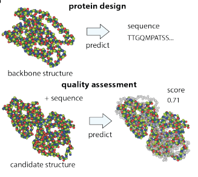

# GVP - Summary

GVP - Geometric Vector Perceptrons

Introducing a neural network architecture (GVP-GNN) that processes protein structures by jointly modeling scalar and 3D vector features, enabling rotation-equivariant learning that captures geometric relationships critical for tasks like protein function prediction and design.

**Input**: 3D structure (coordinates of atoms/residues)
**Architecture**: Graph Neural Network with geometric vectors
**Learns**: spatial relationships (distances, اتجاهים, geometry)
**Output**: structure-aware embeddings
**Requires** known or predicted structure

Learning on 3D structures of large biomolecules is emerging as a distinct area in machine learning, but there has yet to emerge a unifying network architecture that simultaneously leverages the geometric and relational aspects of the problem domain. To address this gap, we introduce geometric vector perceptrons, which extend standard dense layers to operate on collections of Euclidean vectors. Graph neural networks equipped with such layers are able to perform both geometric and relational reasoning on efficient representations of macromolecules. We demonstrate our approach on two important problems in learning from protein structure: model quality assessment and computational protein design.

GVPs operate directly on both scalar and geometric features

GVP-GNN can be applied to any problem where the input domain is a structure of a single macromolecule or of molecules bound to one another

## Use Cases

### Computational protein design (CPD) ###

Computational protein design (CPD) is the conceptual inverse of protein structure prediction, aiming to infer an amino acid sequence that will fold into a given structure.

Input: strucutre
Ouput: amino acid sequence

### Model quality assessment (MQA) ###

Model quality assessment (MQA) aims to select the best structural model of a protein from a large pool of candidate structures and is an important step in structure prediction.
It measures the similarity of the candidate with respect to the experimentally determined structure.

Input: Candidate structure
Ouput: Score - similarity of the candidate to the reference strucutre

## Architecture 

### dihedrals angles 

The O atom is dropped — only N, CA, C are used. These three atoms are then flattened into a single sequence of atoms across all residues:

... N(i), CA(i), C(i), N(i+1), CA(i+1), C(i+1), ...

A dihedral angle is computed for every consecutive 4-atom window in this flat sequence, using the standard definition: the angle between the plane spanned by atoms 1-2-3 and the plane spanned by atoms 2-3-4.

  The four-atom windows map to the standard backbone angles:

  | Window | Atoms | Angle |
  |---|---|---|
  | C(i−1), N(i), CA(i), C(i) | cross-residue | φ |
  | N(i), CA(i), C(i), N(i+1) | within→cross  | ψ |
  | CA(i), C(i), N(i+1), CA(i+1) | cross-residue | ω (peptide bond) |

After computing, the raw angles are lifted to (cos D, sin D) pairs (6 values per residue) and padded to align back to per-residue shape — φ[0], ψ[-1], ω[-1] are zeroed out since they lack the atoms to define them at the chain termini

### Functions

$\mathbf{h}_v^{(i)}$ - The embeddings of node $i$

$\mathbf{h}_e^{(j \to i)}$ - The embeddings of the edge $(j \to i)$

$\mathbf{h}_m^{(j \to i)}$ - Represents the message passed from node $j$ to node $i$.
&nbsp;            
**Propogation step:**

$\mathbf{h}_m^{(j \to i)} := g \left( \mathrm{concat} \left( \mathbf{h}_b^{(j)}, \mathbf{h}_e^{(j \to i)} \right) \right)$  &nbsp;&nbsp;&nbsp;&nbsp;&nbsp;&nbsp; ; &nbsp;&nbsp;&nbsp;&nbsp;&nbsp;&nbsp; $g$ : $\mathbb{R}^{d_b + d_e} \rightarrow \mathbb{R}^{d_b}$

$\mathbf{h}_b^{(i)} \leftarrow \mathrm{LayerNorm} \left( \mathbf{h}_b^{(i)} + \frac{1}{k'} \mathrm{Dropout} \left( \sum_{j : e_{j \to i} \in \mathcal{E}} \mathbf{h}_m^{(j \to i)} \right) \right)$

$k'$ is the number of incoming messages, which is equal to k unless the protein contains fewer than $k$ amino acid residues.

Between graph propagation steps, we also use a feed-forward point-wise layer to update the node embeddings at all nodes $i$:

$\mathbf{h}_b^{(i)} \leftarrow \mathrm{LayerNorm} \left( \mathbf{h}_b^{(i)} + \mathrm{Dropout} \left( g \left( \mathbf{h}_b^{(i)} \right) \right) \right)$

---

### $\mathbf{h}_v$ input -> output

**At the begining (input):**

$\mathbf{h}_v$ = interpretable geometric quantities** that have **clear physical meaning**
- directions between residues
- backbone orientations
- local frames

&nbsp;
**After message passing:**

$\mathbf{h}_v$ is no longer tied to a single physical quantity. It becomes a **learned representation**

Each vector in $\mathbf{h}_v$ becomes something like **“A direction in space that matters for the task”**

## My Comments and Questions

GVP is a general geometric neural network layer, but in the paper it is applied specifically to proteins using a residue-level graph based mainly on backbone atoms.

