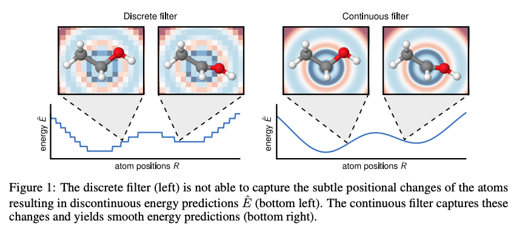
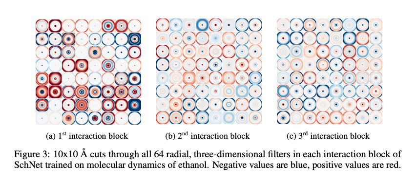

# SchNet - Summary

A novel deep learning architecture modeling quantum interactions in molecules.
Proposing to use continuousfilter convolutional layers to be able to model local correlations without requiring the data to lie on a grid.

- We propose continuous-filter convolutional (cfconv) layers as a means to move beyond grid-bound data such as images or audio towards modeling objects with arbitrary positions such as astronomical observations or atoms in molecules and materials
- We propose SchNet: a neural network specifically designed to respect essential quantumchemical constraints. In particular, we use the proposed cfconv layers in $\mathbb{R}^3$ to model interactions of atoms at arbitrary positions in the molecule. SchNet delivers both rotationally invariant energy prediction and rotationally equivariant force predictions. We obtain a smooth potential energy surface and the resulting force-field is guaranteed to be energyconserving.

## Architecture

### Inputs and outputs

A molecule in a certain conformation can be described uniquely by a set of $n$ atoms with nuclear charges $Z = (z_1, \ldots, z_n)$ and atomic positions $R = (r_1, \ldots, r_n)$

**Inputs**: Atomic numbers (the number of protons in an atom’s nucleus) and positions

**Outputs**: 
- Original paper: the model outputs the energy of the molecule
- EnzymeCAGE: Instead of energy, EnzymeCAGE uses the final embeddings of the enzyme pocket and the reaction center to produce a probability score. A high score means "This uncharacterized enzyme is a perfect match for this specific chemical reaction." 

**Architecture Diagram**

&nbsp;

### Molecular representation

$Z = (z_1, \ldots, z_n)$ - nuclear charges
$R = (r_1, \ldots, r_n)$ - atomic positions

We represent the atoms using a tuple of features $X^{l} = \left( x_1^{l}, \ldots, x_n^{l} \right)$  
$x_i^{l} \in \mathbb{R}^{F}$
$F$ - the number of feature maps
$n$ - the number of atoms  a
$l$ - curren layer

The representation of atom $i$ is initialized using an embedding dependent on the atom type $Z_i$:

$x_i^0 = a_{z_i}$
  

The atom type embeddings $a_Z$ are initialized randomly and optimized during training.

### Shifted softplus

$\mathrm{ssp}(x) = \ln \left( 0.5 e^{x} + 0.5 \right)$

### Atom-wise layers

$x_i^{l+1} = W^{l} x_i^{l} + b^{l}$
  

- Dense layers that are applied separately to the representation $x_i^l$ of atom $i$. 
- These layers are responsible for the recombination of feature maps. Since weights are shared across atoms, our architecture remains scalable with respect to the size of the molecule.

### Interaction

$x_i^{l+1} = x_i^{l} + v_i^{l}$
  

- Responsible for updating the atomic representations based on the molecular geometry $R = (r_1, \ldots, r_n)$
- We keep the number of feature maps constant at $F = 64$ throughout the interaction part of the network.
- In contrast to MPNN and DTNN, we do not use weight sharing across multiple interaction blocks.
- The blocks use a residual connection inspired by ResNet.

### Filter-generating networks

We restrict our filters for the cfconv layers to be rotationally invariant. The rotational invariance is obtained by using interatomic distances as input for the filter network:

$d_{ij} = \lVert r_i - r_j \rVert$
  

Without further processing, the filters would be highly correlated since a neural network after initialization is close to linear. This leads to a plateau at the beginning of training that is hard to overcome. We avoid this by expanding the distance with radial basis functions located at centers $0\,\text{\AA} \leq \mu_k \leq 30\,\text{\AA}$ every $0.1\,\text{\AA}$ with $\gamma = 10\,\text{\AA}$:

$e_k(r_i - r_j) = \exp \left( -\gamma \lVert d_{ij} - \mu_k \rVert^2 \right)$
  

This is chosen such that all distances occurring in the data sets are covered by the filters. Due to this additional non-linearity, the initial filters are less correlated leading to a faster training procedure. Choosing fewer centers corresponds to reducing the resolution of the filter, while restricting the range of the centers corresponds to the filter size in a usual convolutional layer. An extensive evaluation of the impact of these variables is left for future work.

## My Comments and Questions

### Model outputs

- In Original paper: the model outputs the energy of the molecule
- EnzymeCAGE: Instead of energy, EnzymeCAGE uses the final embeddings of the enzyme pocket and the reaction center to produce a probability score. A high score means "This uncharacterized enzyme is a perfect match for this specific chemical reaction." 

